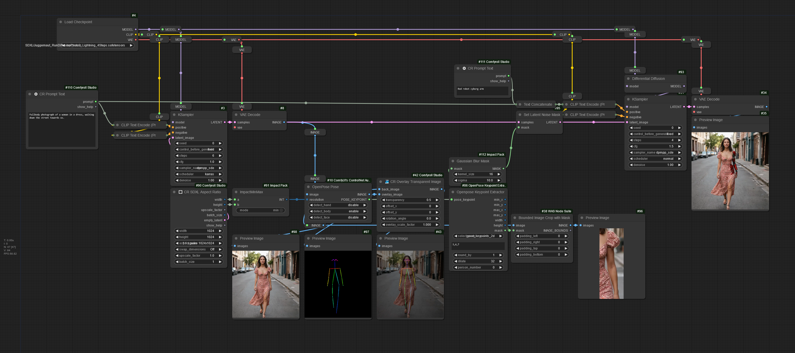
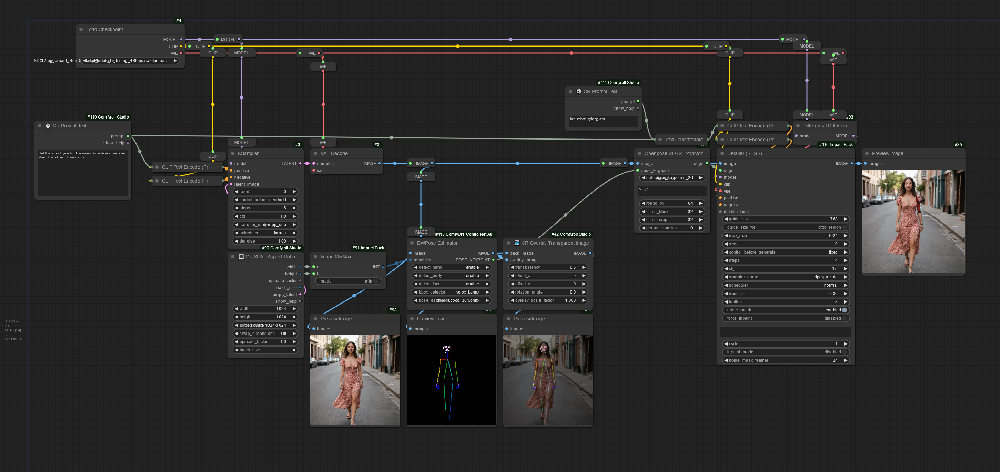

# Openpose Keypoint Extractor

## Openpose Keypoint Extractor node usage

- Node takes the keypoint output from
[OpenPose or DWPose estimator node](https://github.com/Fannovel16/comfyui_controlnet_aux?tab=readme-ov-file#faces-and-poses-estimators)
and calculates bounding boxes around those keypoints.
- Node outputs `min_x,min_y,max_x,max_y` bounding box, `width,height` of the bbox and it's resulting `mask`
- Node allows you to round output pixel values so that cropped resolution is divisible by 8, which is necessary for SDXL
- Note that the points on the OpenPose skeleton are *inside* the particular limb (eg center of wrist, middle of shoulder), so the node allows you to __dilate__ mask around the bounding box to get the whole arm, leg or whatever you're looking for.
- Reference for which control point is which - provide comma-separated list in the Node: [OpenPose Docs](https://github.com/CMU-Perceptual-Computing-Lab/openpose/blob/master/doc/02_output.md)

## Openpose SEGS Extractor

- Same as for Openpose Keypoint Extractor, but has separate crop mask dilate and bbox dilate inputs
- Node allows you to create [Impact pack](https://github.com/ltdrdata/ComfyUI-Impact-Pack) SEGS instead of coordinates and mask.

## Example workflows

Drag this to your ComfyUI

Openpose Keypoint Extractor:

Openpose SEGS Extractor:

